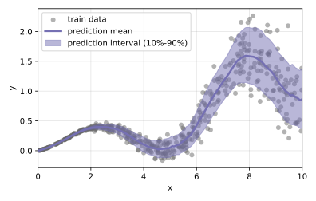

# Foundation models for tabular data

This repository allows for an exploration of foundation models for tabular data. Prior-data fitted networks such as the TabPFN architecture are discussed in the [introduction](notebooks/intro.ipynb). Following this, a [classification](notebooks/tabicl_classif.ipynb) and a [regression](notebooks/tabicl_reg.ipynb) toy problem are solved for demonstration purposes. The TabICL model is used in those examples.

A [simplified PFN model](tab_utils/simple_pfn/) is provided for educational purposes.
The implementation combines ideas from TabPFN as well as TabICL and focuses on clarity and comprehensibility.

<p>
  
  
</p>


## Notebooks

- [Introduction](notebooks/intro.ipynb)
- [TabICL for classification](notebooks/tabicl_classif.ipynb)
- [TabICL for regression](notebooks/tabicl_reg.ipynb)


## Installation

```bash
pip install -e .
```
