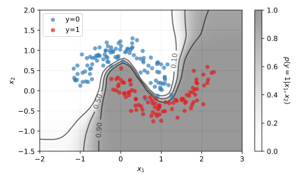

# Foundation models for tabular data

This repository allows for an exploration of foundation models for tabular data. Prior-data fitted networks such as the TabPFN architecture are discussed in the [introduction](notebooks/intro.ipynb). A minimal [demonstration](notebooks/tabicl.ipynb) is provided on the basis of a TabICL model.

## Notebooks

- [Introduction](notebooks/intro.ipynb)
- [TabICL demo](notebooks/tabicl.ipynb)
